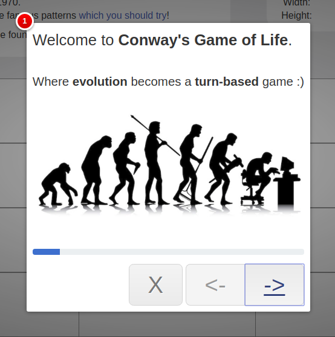
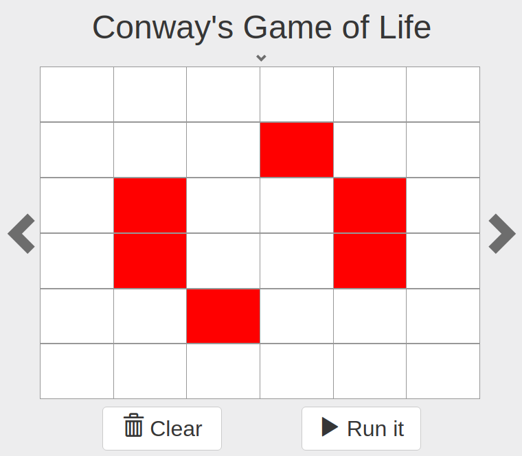
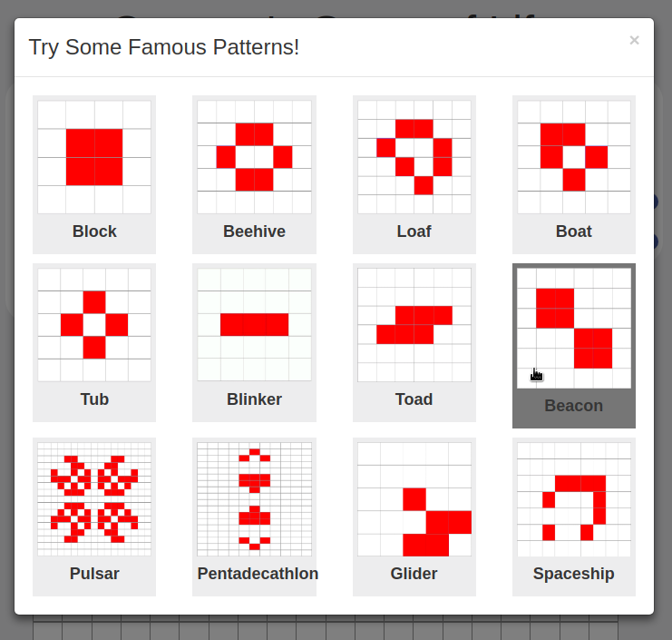
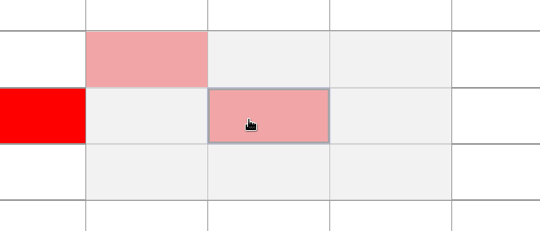
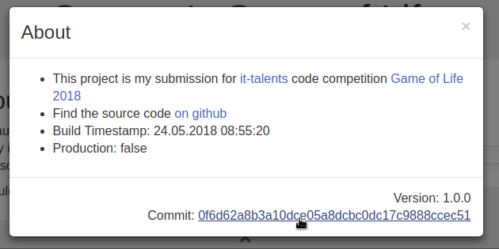

# Conway's Game of Life

An implementation of [conway's game](https://en.wikipedia.org/wiki/Conway%27s_Game_of_Life)
in [Elm](https://en.wikipedia.org/wiki/Elm_(programming_language)).

This is my submission to [IT-Talents](https://www.it-talents.de/) corresponding
[code competition](https://www.it-talents.de/foerderung/code-competition/code-competition-05-2018).

## Run It (The docker way)

Assuming that **docker** (at least version 17.04) and **docker-compose** are installed,
you could simply execute:

```
docker-compose up
```

Now point your browser to [http://localhost:8080](http://localhost:8080), where the application is running.

This command will use a [multi stage build](https://docs.docker.com/develop/develop-images/multistage-build/) to:

- compile the source code
- execute the tests
- bundle the application
- start a [webserver](https://hub.docker.com/_/nginx/) which delivers the webapp on port 8080

## Run It (Developer mode)

Assuming that **npm** and **git** are installed,
you could simply execute:

```
npm start
```

This starts a dev-server with hot reloading usually on port 8080,
hence you could point your browser to [http://localhost:8080](http://localhost:8080).

## Features

I have added some advanced features.

### Tutorial

There exists a 10 step Tutorial which describes the rules of the game and some key features of this application.



### Time Travel

With navigation buttons (the arrows left and right from the board) you could step manually through single generations.



### A Collection Of Famous Patterns

Do you know some interesting patterns in Conway's game of life?
No Problem if not, since I have included a list of famous patterns from
[wikipedia](https://en.wikipedia.org/wiki/Conway%27s_Game_of_Life).
Simply have a look and choose a pattern if you like to try it:



### Overview Of Neighbours

Sometimes you want to know why a certain cell died or become alive.

Since this is completely determined by the neighbourhood of a cell,
you could investigate the restrained marking of those:


This feature comes in handy together with [time travel](#time-travel).

### About Page

Shows mainly continuous integration related informations:



### Configuration

Simply configure the size of the board (**Width**, **Height**) and the speed of the auto-play-mode.

